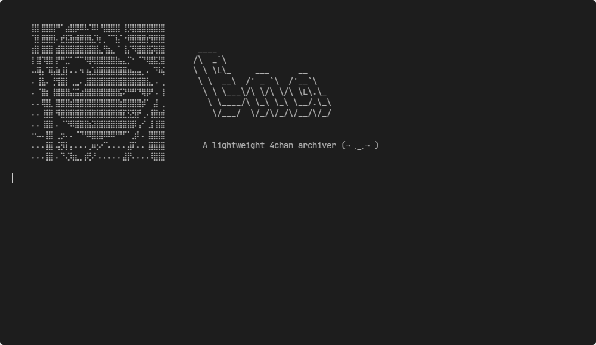

<h1 align="center"><!--<br>-->
Ena</h1><p align="center">An imageboard archiver written in Rust</p><h4 align="center">
<div align="center">

[![Latest Version][latest-badge]][latest-link]
[![Documentation][doc-badge]][doc-url]
[![License][license-badge]][license-url]
[![Unsafe Forbidden][safety-badge]][safety-url]
[![Build Status][build-badge]][build-url]
[![Matrix Chat][matrix-chat-badge]][matrix-chat-link]
[![Discord Chat][discord-chat-badge]][discord-chat-link]

[repo-url]: https://github.com/shiimizu/ena
[latest-badge]: https://img.shields.io/github/v/release/shiimizu/ena?color=orange&style=flat-square
[latest-link]: https://github.com/shiimizu/ena/releases/latest
[license-badge]: https://img.shields.io/github/license/shiimizu/ena?color=blue&style=flat-square
[license-url]: LICENSE
[doc-badge]: https://img.shields.io/badge/docs-latest-blue.svg?style=flat-square
[doc-url]: https://shiimizu.github.io/ena.docs/doc/ena/pgsql/core/struct.Post.html
[build-badge]: https://img.shields.io/github/workflow/status/shiimizu/ena/Rust?logo=github&style=flat-square
[build-url]: https://github.com/shiimizu/ena/actions?query=workflow%3ARust
[safety-badge]: https://img.shields.io/badge/unsafe-forbidden-green.svg?style=flat-square
[safety-url]: https://github.com/rust-secure-code/safety-dance/
[discord-chat-link]: https://discord.gg/phPHTEs
[discord-chat-badge]: https://img.shields.io/discord/134020776251752448?logo=discord&style=flat-square
[matrix-chat-link]: https://matrix.to/#/#bibanon-chat:matrix.org
[matrix-chat-badge]: https://img.shields.io/matrix/bibanon-chat:matrix.org?logo=matrix&style=flat-square
[scc-code-badge]: https://sloc.xyz/github/shiimizu/ena?category=code
[scc-cocomo-badge]: https://sloc.xyz/github/shiimizu/ena?category=cocomo

</div>

</h4>

<br>




Low resource and high performance archiver to save posts, images and all relevant data from an imageboard into a local database and local image store. Currently only supports 4chan.  


## Features

* **Memory efficient**<br>
 Using less than 5mb for a single board and less than 30mb for all 76 boards<sup>*</sup>
 
* **Bandwidth efficient**<br>
 Minimal [API](https://github.com/4chan/4chan-API) requests by using `threads.json` and `archive.json` instead of continuously polling every thread for updates
 
* **Accurate**<br>
 Threads are diffed, patched, and merged by the database so posts are always correct and up-to-date
    
* **Collision resistant**<br>
 Media files and thumbnails are hashed with SHA256 and deduped by using it as the filename
    
* **Preserved comments**<br>
 Untouched in their original HTML format

* **Asagi compatible**<br>
 Capable as a [drop-in replacement](https://github.com/shiimizu/ena/wiki/Asagi)

<sup>\* Without full media & thumbnails</sup>

## Runtime dependencies
* [PostgreSQL](https://www.postgresql.org/download/) >= 11.0

## Getting Started
Download the [latest release][latest-link] or build from source.  

Set your `ENA_LOG` environment variable to `ena=info` for console output. 

Edit the `ena_config.json` file and put in your database connection details, media directory, what boards you want to archive, and tweak any of the other settings that look interesting. Don't go below 0.12s or so for the ratelimit or you'll get banned. Follow the API rules and keep it at or above 1 unless you really need to (If you're not sure whether you need to, you probably don't need to). For more information, see the [configuration page](https://github.com/shiimizu/ena/wiki/Configuration).

Make sure your PostgreSQL server is running.  

You should now be able to run `ena` and have it start archiving, and report status to the standard output, showing requests as they happen, as well as a display of current queued tasks.  
Ctrl-C will stop Ena. To leave Ena running long term, you can use screen (or byobu or any such tool).

## Building
Make sure [Rust](https://www.rust-lang.org/tools/install) is installed. Then run:

```
cargo install --git https://github.com/shiimizu/ena
```

Or the traditional way: 
```bash
git clone https://github.com/shiimizu/ena.git
cd ena
cargo build --release
# Grab the binary from: target/release/
```
> You can also append `-jN` to the `cargo` commands to speed up builds  
> (where `N` is the number of CPU cores you have).   

For more information, see the [building guide](https://github.com/shiimizu/ena/wiki/Building). 

## Usage
```
ena
An ultra-low resource imageboard archiver

USAGE:
    ena
    ena [OPTIONS] [-c CONFIGFILE]
    ena [OPTIONS]
    command | ena -c -

OPTIONS:
    -c, --config            Specify a config file or pass '-' for stdin
    -h, --help              Prints help information
    -V, --version           Prints version information
```

## Why do this?
Much of my personal time and research went into 4chan for *educational purposes* and self development. I value the things I've learned there and have a plethora of threads saved. Although there are available archivers, I wanted a better, more efficient, and robust way to do this.

## Why Rust?
I wanted something fast with a focus on durability, stability, reliabiility, and longevity. Rust has memory safety guarantee, no GC, speed on par with C, and an ecosystem like Python's. Paying upfront in development time in return for less debugging and runtime errors is a small price to pay. If it compiles, it just werks. For more reasons, see the [Why Rust? page](https://github.com/shiimizu/ena/wiki/Why-Rust%3F).

## What's with the name?
> Asagi is the eldest of the Ayase sisters. Fuuka is the middle sister. The Ayase family lives next door to Yotsuba. Get it?  
> – *ekopsl*  

Ena is the next in line and youngest of the Ayase sisters.

